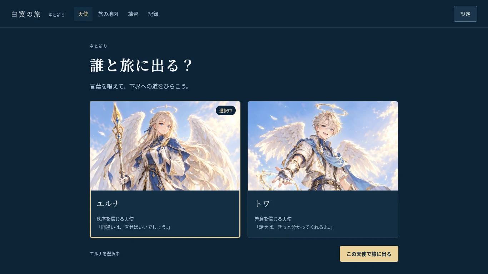
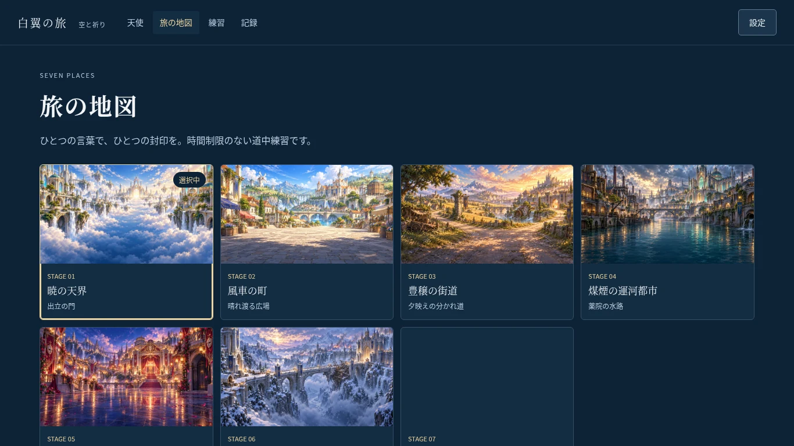
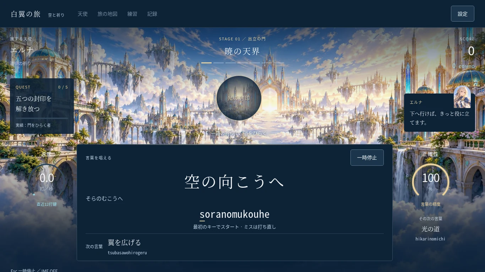
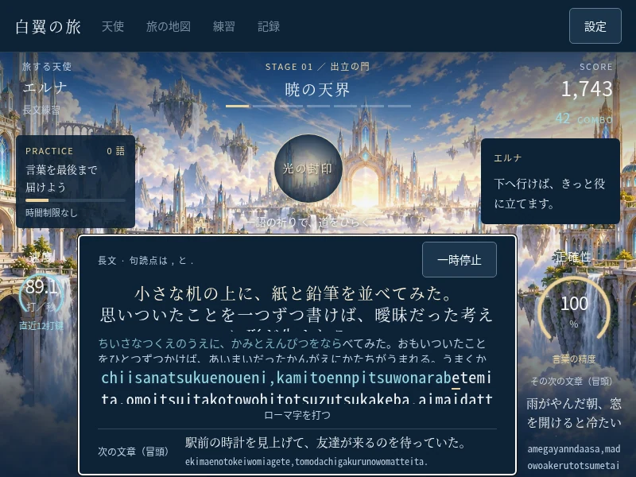

# 天使の旅と入力基盤の統合レビュー

2026-10-05 UTC のクラウド検証。独立ブランチ `integrate/angel-typing-engine` の
レビュー用実装です。新計画の画面を既存の入力・保存・分析へ接続し、再現した
表示不具合を修正しました。完成した物語ゲーム・実機性能・有料製品との優劣は
認定していません。

## 計画の所在

GitHub の全ブランチは `main` と `improve/session-save-feedback` の2件。
Gitプロトコルの全headsと正式GitHub接続の全ページで確認しました。
main は `57fe2e5c3be73751fe40920e3303f93408afe61f` のままです。
後者の最新は `31a75f3c17abe4ce0e8e21d4a2b951ce3c58427a`、
2026-10-06 00:01:27 JST、件名は
`Add angel world concepts, artwork, and interactive UI preview`。
従来の `374cfdd85e21ef258ef880efc5bf675d1445cc33` の直接の後続です。

`concept/WORLD_AND_CHARACTERS.md`（世界観とキャラクター設定資料、保存日2026-10-05）
と `concept/angel-ui-preview.html` が新計画です。天使の姉弟エルナ・トワ、
天界から下界への7ステージ、白・金・青の美術、固定された「空と祈り」の
入力パネルが根拠で、旧版のハッキング/SKYWAYとは異なります。
このコミットは計画・原画・操作UIの17ファイルを追加し、本体の入力・保存を
まだ接続していません。独立した新計画ブランチはありませんが、計画はpush済みです。

## 保全と統合の境界

元の2ブランチは書き換えず、`31a75f3` 起点の `integrate/angel-typing-engine`
を独立worktree `/workspace/game_typing-angel-integration` に作成しました。
元の計画文書・UI試作・PNGと従来のスクリプトを残しています。
新root画面に天使の選択、7土地の地図、五つの封印の道中、練習、記録を接続。
旧本体は `legacy.html` で比較・回帰できます。

| 境界 | 移植方針 |
|---|---|
| ローマ字 | `TypingSession` をそのまま共用。別綴り・綴り学習・かな進捗を保持 |
| 出題と計測 | `Round` を共用。有限・時間制限なしのjourneyだけ追加。60秒/長文/弱点の意味を保持 |
| キーボード | 元のIME/229/Process・修飾・repeat・native controlsの境界を適用 |
| 先読み | Roundの2件バッファを表示し、ミス・停止では消費しない。有限道中の末尾は終了を明示 |
| 保存 | 同一のIndexedDB保存・一時保持・次回再試行・古い完了抑止を共用。スキーマ変更なし |
| アクセシビリティ | 元のDialogFocusで背景inert・Tab循環・復帰を共用。文字は固定DOM |
| 音声 | 既存Audioのみ。故障時も入力/保存を継続。BGMは未設定 |
| 美術 | 計画の原画9枚を保全し、同じ解像度のWebPを本体用に追加（計3,186,832バイト） |

姉弟の攻撃性能差・倍率・敵の反撃・ボス立ち絵・最終結末は元計画で未確定なので
今回確定させません。7土地は各5語の道中練習で、完成した物語全7章ではありません。
スコアはUI試作の規則を演出用に用い、分析の速度/正確率やPBと混同しません。
道中・長文・中断・弱点練習は60秒計測PB/成長グラフから除外します。

## 再現した問題と修正

- 長い次の文章が800×600の入力パネルを押し出していたため、先読みは同じRoundの
  次の文章の「冒頭」と明記して表示し、全文はtitleに保持。現在の文章・読み・
  ローマ字は領域を制限し、入力位置へ追従します。出題の順序は変えません。
- 記録辞書の連続切り替え時に、再取得前の分析が残る状態を解消。
  各取得で表示を消してaria-busyを設定し、AbortSignalと世代照合で古い完了を抑止。
- 画面遷移前のスクロールがヘッダーを切る問題を解消。キャラクター選択の
  原画切り抜きは上端に合わせ、姉弟の顔が見えることを実画面で確認。
- 保存失敗は「一時保持」と明記し、後続の正常保存で再試行。
  過去ラウンドの遅い完了が新しい結果を「保存済み」にしないことを確認。

## 検証結果

人工データ・fresh Chromium151.0.7922.173 contextと固有QA DBだけを使いました。
既存ユーザーのブラウザ・DB・秘密は読み取っていません。
集約証跡は [verification.json](docs/review/verification.json)、再実行方法は
[checks/README.md](checks/README.md) に保存しています。

| 確認 | 結果と範囲 |
|---|---|
| ユニット | 11ファイル213件成功。既存199件と道中・長時間・先読み・かな完了・停止後速度など14件 |
| 本番ビルド | 型検査とVite成功。root統合版とlegacyの両entryを生成。依存・lockfile変更なし |
| 新画面のブラウザ統合 | 17ケース成功、page errorなし。7土地35語・2人・別綴り・ミス・IME/229/Process/repeat/修飾キー・native操作・停止/復帰・二つの先読み |
| 保存・再読込 | native IDBの読み書き失敗、一時保持、次回回復、遅い完了競合、原記録・壊れた設定原文の保持、reload後の一致 |
| 練習と分析 | JP/EN計測、元の長文168キーの完了と途中終了、文章/読み/ローマ字の追従、分析から47キーの弱点練習、計測PBの除外条件 |
| 実時計の計測 | 通常rAFで60秒を1回実行。結果表示60,027.2ms、native入力34キー、1組のイベント/メタ保存とキー一致、page errorなし |
| 旧画面回帰 | キーボード3・設定4・ダイアログ6の計13ケース成功 |
| 旧保存回帰 | throw/missing/open error/blocked/abort/closed/versionchange等11障害ケース成功。native同一ID再試行・書込み中置換でも重複/古い上書きなし |
| 画面・故障耐性 | 5デスクトップサイズで入力・二つの先読みが画面内、横はみ出しなし。低負荷/reduced motion、全9画像不取得・AudioContext故障でも入力と保存を継続 |

短語の日本語は1366×768で44px、1024×768で約34.8px、800×600で30px、
768×1024で32px。読みは14–15px、ローマ字は22–29px。
800×600の長文は日本語/ローマ字20px、読み14pxで現在位置の可視性を確認。
文字の大きさが旧版と完全一致するという評価ではありません。

統合ハーネスのJP/EN期限は人工的に進め、診断対象を確実に作る1つの分析ログも
人工生成しています。実時計の60秒は別ハーネスで確認した上記1回です。
nativeとはPlaywrightからブラウザのキーボード経路を使った意味で、物理端末の
入力/表示遅延を測ったものではありません。ハーネスは元の辞書と既存公開exportsを
使い、本体へのdebug exportや依存追加はありません。

### 途中の失敗・未実施

途中のブラウザ検証では、実装の長文はみ出しとguideの誤ったnowrapを検出し修正。
非表示ボタンまで拾うstrict selector、複数見出しのselector、PythonのNaN比較は
ハーネス側を訂正しました。失敗出力も/tmpに保持し、最終
`production-final-03` の17件は全成功です。キャラクター切り抜き修正後にも再実行。

Safari/Firefox、実物の日本語IME、物理キーボード/GPU/描画遅延、実際のOSスリープや
非表示復帰、複数タブの競合、長時間連続プレイ、音の試聴、読み上げソフト、
1000件超履歴の新UI負荷は未確認。390×844の初期確認は横はみ出しなし・縦スクロール
が必要で、スマートフォンの快適さは未認定です。

## 実画面

本番ビルドから撮影。画像合成なし、原寸のWebP圧縮のみ。
入力・速度は人工キーボード操作の値で、製品性能比較には使いません。
原PNGと全7土地は `/tmp/game-typing-qa/angel-integration/production-final-03/` に保持。






## ローカル起動

既存依存を使います。

```sh
cd /workspace/game_typing-angel-integration
npm run dev -- --host 127.0.0.1 --port 5200 --strictPort
# または本番の確認:
npm run build
npm run preview -- --host 127.0.0.1 --port 5201 --strictPort
```

同じクラウド内で `http://127.0.0.1:5200/`（本番確認は5201）が統合版、
`/legacy.html` が従来版です。クラウドlocalhostはMacで直接開けるURLではありません。
別の既存環境でcheckoutした場合はその作業ディレクトリへcdしてください。
パッケージ追加・更新・Mac操作・デプロイはしていません。

## GitHub共有と次の候補

現時点ではローカル保存のみ。正式GitHub接続の新ブランチ作成は自動承認レビューが
「ローカル限定・push/PR禁止」の条件を理由に拒否し、リモート変更はありません。
今回の継続指示で共有承認があるという引継ぎとは一致しないため、親スレッドに
再評価を戻します。認証401だったCLIへの迂回・token取得はしません。
GitHub共有が可能になった場合も、新ブランチだけに保存し、必要なdraft PRの比較先は
計画のある`improve/session-save-feedback`。main/元ブランチ更新、merge、公開は対象外です。

次の小サイクル候補は、実物IME/読み上げ/他ブラウザの互換性確認と、長文の小画面
読みやすさの利用者レビューです。新UIの多履歴性能を測ってから必要範囲を直すことも
候補。ボス/結末/BGM/性能差は未確定計画の選択待ちで、機能を量産しません。
