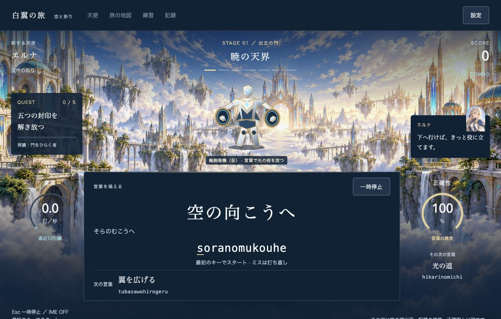

# edd518b ソースZIPの統合

対象: `game-typing-edd518b-source.zip`。提供元コミット: `edd518bac6965a18703553e980dbd6e907787991`。

## 取り込み

- 収録59ファイルをMANIFESTのサイズ、SHA256、Git blob SHA1と照合し、すべて一致。
- 現在版との差分はステージ1の攻防演出・効果音・テスト・検証スクリプト・制作予定。
- 辞書、入力エンジン、記録保存、設定、画像、依存関係は現在版とバイト単位で一致。
- ZIPから変更・追加ファイル10件を取り込み、既存の原画とレビュー資料を保持。
- Git履歴を含まないスナップショットのため、提供元コミット自体の履歴は統合していない。

## 提供版で見つかった問題

`docs/ROADMAP.md` が参照していた `stage1-combat-20261006.md` と
`stage1-readability-20261006.md` はZIPに含まれていない。
未収録であることを明記し、このレビューへのリンクに変更した。
実装構成のブラウザ検証本数と、READMEの演出案内も現在の構成に更新した。
配送専用のREADMEとMANIFESTはアプリのルートには追加していない。
元ZIPは変更していない。

## この環境での確認

- `npm test -- --maxWorkers=1`: 11ファイル、196件成功。
- `npm run build`: TypeScript検査と単一HTMLの本番ビルド成功、23モジュール。
- `checks/` 全Pythonスクリプトの構文確認成功。
- README・検証手順・構成・制作予定・本レビューのローカル参照先を確認し、欠落なし。
- Macのアプリ内ブラウザで、ステージ1の6状態を実際に観察。
  予兆と接近では軌道、防御と衝撃では異なる形のマークを確認した。
- 一時停止の前後でSVG全体と時計表示が一致し、再開後も入力できた。
- 道中5語を完了。67打鍵（正入力66・ミス1）、完了表示と保存確定を確認。
  記録の分析画面で、再読み込み前後の打鍵数が一致した。
- ステージ2には新しいSVGが表示されず、従来の封印と入力を表示した。
- ステージ1の長文で51打鍵後の節目表示を確認。次の正入力後にも節目表示が残り、
  通常のキー演出も処理された。SVG要素は66、表示粒子は最大12の範囲内だった。
- 通常画面サイズの長文で、SVGが中央の演出領域内に収まり、入力・二つの先読み・
  速度・正確性・台詞への重なりと横スクロールがないことを確認した。
- 確認用タブのコンソールに警告・エラーなし。確認用タブは終了した。

## Playwrightの導入と追加検証

ユーザーの追加指示により、公式PyPIからPython Playwright 1.60.0をプロジェクトの
`.venv` に導入した。システムPythonのパッケージは変更していない。
依存検査とimport確認は成功。再導入用の版指定は `checks/requirements.txt`、
実行手順は [ブラウザ検証](../../checks/README.md) に記載した。
ブラウザは既存のGoogle Chrome 154.0.8037.98を使い、追加ダウンロードは行っていない。

本番ビルドを一時プレビュー `127.0.0.1:5180` で配信し、次の5本を順番に実行した。
人工データと新しいブラウザコンテキストのみを使い、既存のユーザープロファイルは読んでいない。

| 検証 | 結果 |
| --- | --- |
| `stage1_combat_check.py` | 7項目成功。軌道・防御と衝撃の形・接触時間・強打の持続・停止・保存・小画面・長文・低負荷・動き軽減。演出ON/OFFで入力ログと結果が一致。 |
| `angel_integration_check.py` | 17項目成功。7土地・入力境界・保存故障と回復・停止・長文・計測・分析・画像と音声故障。 |
| `angel_finish_check.py` | 7項目成功。4長文を5つの小画面サイズで完了、7土地の遷移・設定・途中保存・人物表示。 |
| `angel_real_timer_check.py` | 成功。実時計の60,010.9msで計測を終了し、40打鍵をすべて保存。 |
| `stage1_frame_cost_check.py` | 成功。演出ON/OFFを3組、各160サンプル。JSフレーム処理のp95はONが約0.4ms、OFFが約0.4〜0.6ms。 |

機能検証は計32項目。全スクリプトが終了コード0で完了し、ページエラーはなかった。
原データに基づく結果は [検証JSON](zip-integration-edd518b-checks.json) に保存した。
JSONには各項目の成否・主要指標・元の検証結果のSHA256をまとめた。
性能値は今回のMac・Chrome内でのJS処理時間であり、GPU、FPS、物理入力遅延の測定ではない。
演出ON/OFFの性能差を一般化する結果としては扱わない。
検証ブラウザと一時プレビューは終了した。

## 今回の未確認範囲

実物の日本語IME・読み上げソフト・物理入力遅延、Safari/Firefoxは未確認。
完成した敵素材・ボス規則・HP・BGMは未実装。

各重い処理の前後でリソース監視を確認した。メモリ圧力・スワップ使用量・プロセスRSSは
OSの取得制限により利用できず、その取得のために権限を昇格していない。
検証終了時の監視アラートはなかった。

確認の範囲ではゲーム入力・停止・保存の不具合は見つからなかった。
敵は仮のベクター素材、攻防は演出のみで、ゲームの難易度や結果は変えない。
ローカル確認用サーバーは `http://127.0.0.1:5179/` で継続する。
